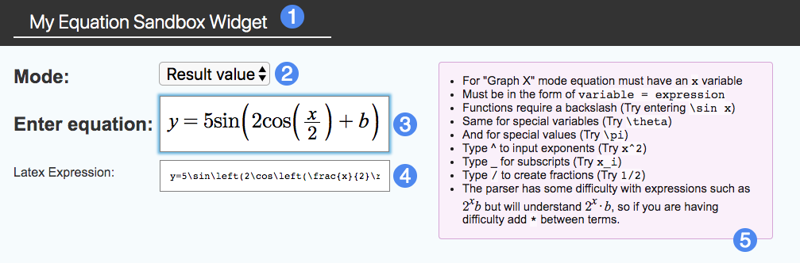
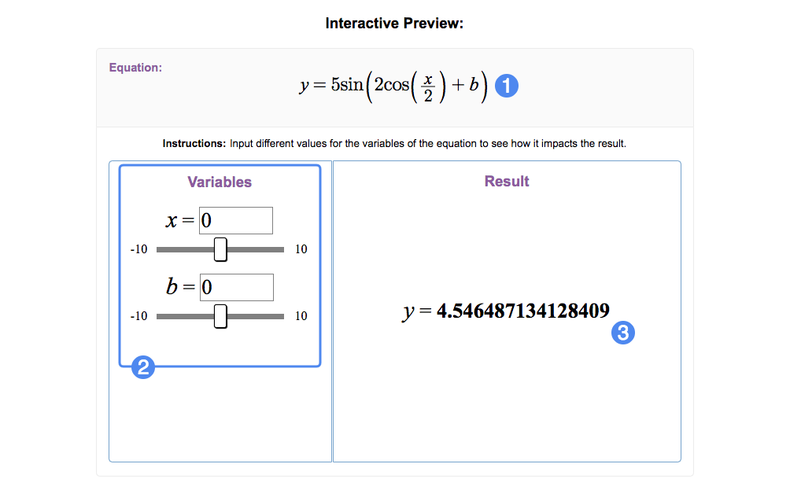

# Creator Guide #

## Overview ##

With Equation Sandbox, students will be able to experiment with the graph of an equation you create. Manipulating the variables of the equation will alter the graph, allowing students to learn first-hand how a function graph is created.

1. Widget title
2. Result mode: Result Value or Graph X
3. Equation input box
4. LateX expression input box
5. Tips for equation input

## Details ##

For a given equation, Equation Sandbox has two modes of displaying the resulting values: **Result Value** will display the numerical output of the equation with the given variables, while **Graph X** will graph the values of X and Y. Note that using the **Graph X** mode will provide additional options for tangent line visibility and graph bounds.

For more complex equations, it's recommended you use **LaTeX** for expression composition, a document preparation system specialized for precise mathematical input. Note that this guide will not cover the nuances of LaTeX.

The **Interactive Preview** section allows you to review how your widget will appear to students:

