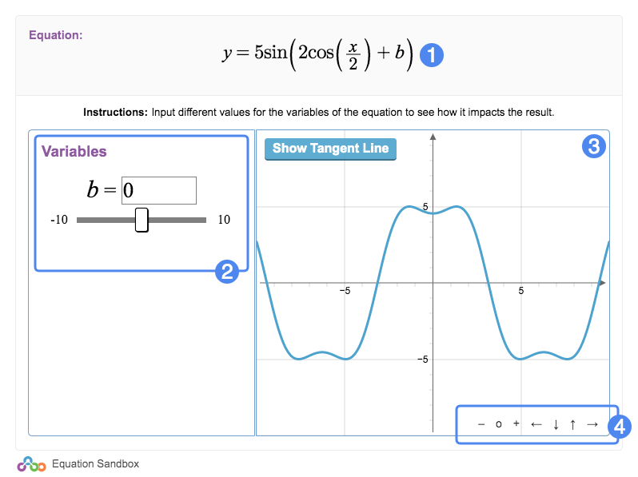

# Player Guide #

## Overview ##

With Equation Sandbox, students will be able to experiment with the graph of an equation you create. Manipulating the variables of the equation will alter the graph, allowing students to learn first-hand how a function graph is created.

1. Equation
2. Variable controls
3. Output visualization
4. View controls (graph only)

Equation Sandbox will visualize the value of Y in one of two ways: either as a numerical value, or as a graph of X and Y. Use the controls on the left to manipulate equation variables and see the resulting values change.

Note that this widget will not be scored: it is best utilized as a learning aid or study tool.